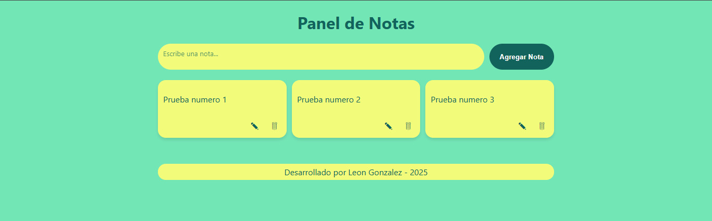

# Panel de Notas

Aplicacion web simple para crear, editar y eliminar notas.
Desarrollada como proyecto base para practicar fundamentos de desarrollo web y control de versiones de Git y GitHub.

---

## Caracteristicas

- Crear, edita y eliminar.
- Guardado automatico con **LocalStorage**.
- Interfaz moderna y responsiva
- Control de versiones con ramas (`dev `y `main)

---

## Tecnologias utilizadas

- **HTML5**
- **CSS3**
- **JavaScript (ES6)**
- **LocalStorage**
- **Git + Github**

---

## Proximos pasos

- Migrar a **React**.
- Añadir persistencia con **Node.Js + Express + MongoDB**.
- Autenticacion de usuarios.
- Despliegue en **Vercel** y **Render**.

---

## Como ejecturar el proyecto

- Clona el repositorio.
- Abri el archivo index.html en tu navegador.

---

## Captura de pantalla

---

# Autor

**Leon Gonzalez**
[GitHub](https://github.com/MaAhesKing26)
